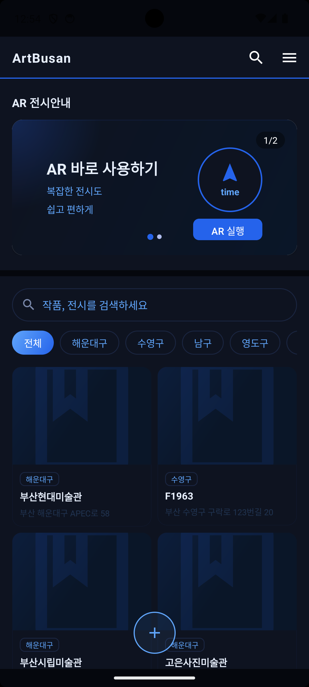

# ArtBusan

부산 미술관·박물관을 위한 AR 기반 전시 안내 Android 앱

<br>



<br>

## 주요 기능

| 기능 | 설명 |
|------|------|
| **AR 길찾기** | AR 기술을 활용한 실내 동선 안내 |
| **나의 전시투어** | 저장한 투어 경로 관리 |
| **스탬프** | 전시실 방문 기록 수집 |
| **AR 카메라** | 카메라 연결 AR 실행 |
| **탐색** | 소장 작품 카테고리별 검색 및 탐색 |
| **투어 제작** | 나만의 전시 투어 동선 제작 |

<br>

## 화면 구성

- **Home** - AR 길찾기 배너, 많이 찾는 서비스 바로가기, 추천 투어 동선
- **Explore** - 소장 작품 그리드 목록 (회화/조각/공예/유물/특별전 필터)
- **Create** - 새 전시 투어 동선 제작
- **Profile** - 알림·언어 설정, 앱 정보

<br>

## 기술 스택

- **Language** : Kotlin
- **Min SDK** : Android (Gradle 기준)
- **Architecture** : Single Activity + Fragment Navigation
- **UI** : Custom XML Layout, RecyclerView, DrawerLayout
- **Navigation** : Jetpack Navigation Component

<br>

## 프로젝트 구조

```
app/src/main/
├── java/com/example/artbusan/
│   ├── MainActivity.kt        # 바텀 네비게이션, 드로어 메뉴 관리
│   ├── HomeFragment.kt        # 홈 화면
│   ├── ExploreFragment.kt     # 탐색 화면 (작품 목록)
│   ├── CreateFragment.kt      # 투어 제작 화면
│   ├── ProfileFragment.kt     # 프로필 화면
│   ├── ArtworkAdapter.kt      # 작품 리스트 RecyclerView 어댑터
│   └── ArtworkItem.kt         # 작품 데이터 모델
└── res/
    ├── layout/                # 화면 레이아웃 XML
    ├── drawable/              # 커스텀 배경, 아이콘
    └── navigation/            # 네비게이션 그래프
```
